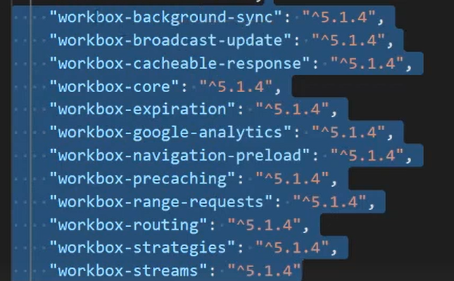

# 1. Generacion de funcionalidades PWA en aplicacion existente.
Pasos para convertir una app web normal en una Progressive Web App (PWA).

Tener en cuenta que las PWAs trabajan en entorno de *`produccion`* no de desarrollo.
1. *Instalar todas las dependencias de `Workbox`.* 

2. *Generar nuestra app o desplegarlo en produccion y instalar el paquete serve*
```bash
    $ npm run build

    # instalar serve
    $ npm install -g serve

    # Desplegar en un servidor de produccion local
    $ npm run buil && serve -s build -l 5000
```
3. *Crear los archivos relacionados con el `service-worker.js` y el `serviceWorkerRegistration.js`*
    - Copiar y pegar estoy archivios de la leccion anterior
    - Con los comentarios tambien se actualiza la aplicacion
4. *Instalar la dependencia de `service-worker-updater`*
```bash
    $ npm i  --save-dev @3m1/service-worker-updater
```
