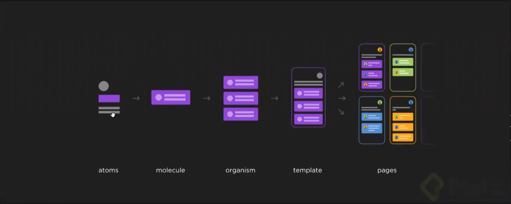

## 1. Metodologias de Desarrollo en React JS (Arquiteturas de SOFTWARE)
### 1.1 Arquitectura Hexagonal
*Esta aquitectura es una metodologia de desarrollo de aplicaciones, donde toda la logica de `negocio` esta en el `medio` del exagono*

*Todos los compenentes que integran la aplicacion se comunican mediante `puertos`. Es por el puerto que la aplicacion de fron-end se comunica con el back-end, etc*

*Cada componete de la aplicacion esta  independiente de la tecnoligia en el que esta echo, solo es importante la integracon y la comunicacion entre estos elementos*

*La idea es contruir el software por piezas o componentes `estancas`; es decir no importa la tecnologia en el que esta echo el `componente`, solo interesa la comunicacion de estos componentes mediante puertos con la logica del negocio*.

__*Este es una metodologia de software lo que haces es `estancar` diferentes partes de la aplicaion, para que ecuando se tiene que migrar el codigo a otro tipo de framework, ya no se tenga que cambiar nada de lo que ya exista y que pueda seguir la misma logica de negocio, las mismas integraciones, las mismas bases de datos y las mismas tecnologias*__

eg: 

Ahora estamos trabajando  con nuestra aplicacion en la base de datos de `firebase`, ahora si queremos cambiar la base de datos, tendrias que usar las mismas tecnologias con las que hemos echo nuestra aplicacion y utilizar la misma logica de `negocio`
Componentes de la arquitectura Hexagonal

### 1.2 Arquitectura Limpia en React JS
*Este tipo de aquitectura se basa en capas*

*Este es un tipo de arquitectura en el que la aplicacion se base en diferentes componentes que engloban y que encierran en el medio la `logica de negocio`, el cual es independientemente de la tecnologia.*

*Este es un marco de trabajo basado en `capas`*

eg:

1. Entidades
2. Casos de uso
3. Controladores, presentacion, puertos
4. Dispositivos, webs, UI, Interfaces externas, DB.

__*La capa que se encarga de conectar la logica de negocio y las diferentes utlidades y servicios con las que interactua el usuario final, es la `interfaz`. Esta itefaz conecta la aplicacion en si con `los casos de uso` de la app*.__

__*Lo que haremos en la sesion practica es aprender como separar cada uno de los componetes de nuestra app `para seguir la metodolia de la aquitectura limpia`*__

### 1.3 Atomic Design

*Se trata de dividir el disenio de nuestra apilcaciono del software en 5 partes*
*Este es una metodologia centrada u orientada particularmente en el disenio CSS o en disenio de la presentacion de la aplicacion*

1. Atoms
2. Moleculas
3. Oganismos
4. Templetas
5. Paginas

