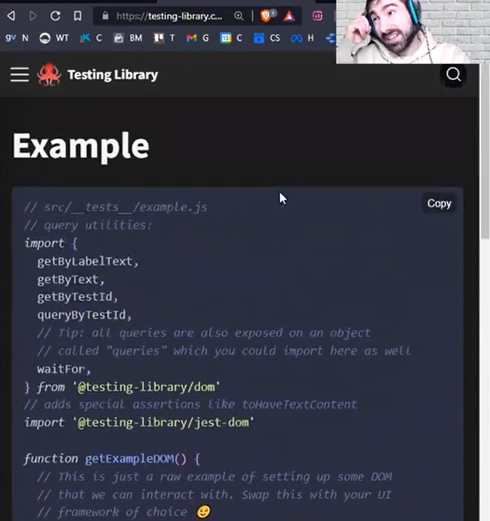

# TESTING con React JS

## 1. Introduccion al Testing

- Es una serie de procesos.
- _Es una disiplina de la ingenieria de software que permite tener procesos, metodos de trabajo y herramientas para identificar defectos en el software alcanzando un proceso de estabilidad del mismo._

- **Es un desiciplina que compone de procesos y herramientas para eliminar en la mayoria del parte los `bugs` o errores en al fase de desarrollo de la aplicacion**

Caracteristicas:

- _Permite identificar errores durante las fases de `desarrollo`_
- _Asegura la confinza del usuario final y su satisfaccion al usar el software._
- _Optmiza la experienica de usuario final de la aplicacion_
- _Permite asegurar la `calidad` del producto y su correcto funcionamiento._
- _Es necesario para mantener la reputacion del negocio en el sector._

## 2. Introduccion al concepto de `Coverage`

- _Es el grado de covertura de la apliccion con respecto a los `tests`._

eg.

- _Si tenemos una aplicacion con 4 funciones y queremos testear las 4 funciones y una de ellas pasa, solo tendriamos que testear los otros 3 que faltan._

- Depende mucho de los `testers` que tanto de covertura se necesita realizar de la aplicacion. Trata de definir que porcentaje de la aplicacion se necesita realizar el `testing`.
- _El concepto de `coverage` demanda mucho de recursos, `experiencia`, de los desarrolladores para poder realizar `completamente` el testing de la aplicacion_.

## 3. Metodoligia TDD (Test Driving Development)

- _Desarrollo Guiado por los Tests_
- _En proyectos grandes o extensos es util esta metologia_
- _Cuando se comience a desarrollar, se deben implementar los `casos` de test para controlar mejor el desarrollo._
- **Primero se deve implementar las `pruebas  unitarias` y luego se implementa la `refactorizacion`**

### Objetivos del TDD

1. _Minimizar el numero de bugs_
2. _Implementar las funcionalidades justas que el cliente necesita y no mas_
3. _Producir software modular, altamente reutilizable y preparado para el cambio, y utilizarlo en todas partes del proyecto_
4. _Optimiza los recursos para desarrollar el producto_

## 4. Tipos de testing y diferencias

1. Forma.

- _Manual_: Se implementa las funcionalidad manualmente.
- _Automatizada_: Dentro de las casos de prueba se verifique automaticamente un determinada funcionalidad.

2. Nivel.

- _`Funcional`_: Se trata del propio comportamiento o funcionalidad de las partes de la aplicacion.

  1. `Unitarias`: _Cuando hacemos click aparece un alerta_
  2. `Integrales`: _Cuando se implementa un funcion general que se integran por debajo de esta funcion principal._. Se prueba las funcionalidades una detras de otra funcion. Se prueba una serie de funcionalidades a cada una estas funciones y una prueba general para probar la conectividad de estas.
  3. `End to end`: _Es una forma de realizar el testeo desde la parte superior hasta la parte final del proceso_. Se mira arriba se mira abajo si ha pasado la prueba se acepta.
  4. `Aceptacion`: _ES una forma de que la prueba es aceptado por el usuario_
  5. `Regresion`: _Se trata de implementar tests y se verificar que las funcionalidades que se han echo en la version anterior de la aplicacion funcionen correctamente en la version nueva que se esta desarrollado_
  6. Sanidad, Humo, Sistema

- _`No funcionales`_
  1. UX, Disenio, Seguridad, calidad
  2. Tiempo de carga, fuentes, seguridad, etc
  3. Rendimiento
  4. Portabilidad
  5. Portabilidad
  6. Usabilidad
  7. Estres
  8. Carga

3. Metodos

- _`Caja Blanca`_: _Entrar dentro del componente y ver toda la logica, toda el comportamiento y `testear` la funcionalidad de este mismo_.
- _`Caja Negra`_: _Es cuando se implementa una funcionalidad, y no se save que hace por dentro, solo se comunica por fuera pasandole arguemntos y se obtiene un resultado, independientemente de lo que pasa por dentro_. Los componentes de react se consideran como `cajas negras`.
- _`Caja Gris`_: _Es hacer una mezcla de las anteriores metodologias_

## 5. Introduccion a JEST.

- _Es una de las librerias mas usadas y empleadas para JS y React JS_
- _Es empleado por mas de 1GB de repositorios_
- _Esta basado en MOCHA testing_
- _Nos permiten realizar pruebas aizladas_

Instalar las dependecias de react-test-render

```bash
    $ npm install -D react-test-renderer
```

- Esto nos permite simular que estamos ejecutando una aplicacion de React JS o que estamos renderizando un componente de React JS.

- Para agrupar todos los tests se usa el describe
- ejemplo de la session-09 para testear el Todo.jsx componente.

```jsx
import { cleanup, render, screen } from "@testing-library/react";
import Todo from "../src/components/pure/Todo";

// ESto se usa para borrar todos los renderizados anteariores
afterEach(() => cleanup());

describe("Todo component is workin correctly", () => {
  const todo = { id: 5, text: "Hacer la compra", completed: true };
  render(<Todo />);
  const todoelement = screen.getByTestId(`todo-test-${todo.id}`);
  it("should render Todo component", () => {
    expect(todoelement).toBeInTheDocument();
  });

  it("should have right text", () => {
    expect(todoelement).toHaveTextContent(todo.text);
  });

  const todo2 = { id: 5, text: "Hacer cena", completed: true };
  render(<Todo todo={todo2} />);
  const todoelement2 = screen.getByTestId(`todo-test-${todo2.id}`);
  const checkbox2 = todoelement2.querySelector("#checkbox2");

  it("should be checked", () => {
    expect(checkbox2).toBeChecked();
  });
});

describe("Todo component should check/uncheck completed/not completed todos", () => {
  const todo = { id: 5, text: "Hacer la compra", completed: true };
  render(<Todo />);
  const todoelement = screen.getByTestId(`todo-test-${todo.id}`);
  const checkbox = todoelement.querySelector("#checkbox");

  it("should be checked", () => {
    expect(checkbox).toBeChecked();
  });
});
```

## 6. How to make a test

- _La nomenclatura de es la siguiente `<name>.test.js`_
- _Los archivos con la extension `.test.js` son consideredos o llamados `suite tests`_.
- _Dentro de cada suite tests pueden haber varios `casos de prueba`_.

Metodos:

1. Describe:

- _Este nos permite reunir dentro de un mismo grupo, tener varios tests o implementar muchos `casos de prueba` para testear una misma funcionalidad_.

2. It:

- _Este es un alias de `test`._

3. Assertions:

- _Son es una forma de decirlo que esto es `asi`_.
- _Se usa la palabra reservada `expect`_
- _Este es un `matcher` que nos permite verificar si el `test` es igual que el valor que se espera que sea_.

para correr todos los tests del implementados en el proyecto se usa el comando:

```bash
    $ npm test
```

### Matchers (Comparaciones)

Numeros

1. `toBe()`: permite vincular la respuesta de un valor con la entrada del test.

2. `toEqual()`: permite vincular la respuesta de un valor de entrada del test, pero es especialmente para `objetos`.

3. `not()`: permite revertir el valor del test.

Strings 4. `toMatch`: permite matchear strings en los casos de prueba.

### Mocks

- _Estos son ni mas ni menos que funciones falsas para testear el funcionamiento de nuestra aplicacion_
- *Son funciones que estan escuchando cuantas veces estan siendo llamadas estos, con que argumentas son llamados, etc*

```jsx
describe("Assertions  con funciones mock", () => {
  test("Que la funcion haya sido llamada mockFn", () => {
    const mockF = jest.fn(() => 5);
    const res = mockF();
    expect(mockF).toHaveBeenCalled();
  });

  test("Que la funcion haya sido llamada varias veces: mockFn = 3 ", () => {
    const mockF = jest.fn(() => 5);
    const res = mockF();
    const res1 = mockF();
    const res2 = mockF();
    expect(mockF).toHaveBeenCalledTimes(3);
  });

  test("Que la funcion haya sido llamada con un parametro: testing enjoy", () => {
    const mockF = jest.fn(() => 5);
    const res = mockF("testing enjoy");
    expect(mockF).toHaveBeenCalledWith("testing enjoy");
  });
});
```

## 7. Testing de componentes de React JS

- \*Es testeo de componentes se hace mediante los metodos `render` y `screen ` de la libreria `@teting-library/react`.

eg.

```js
import { render } from "@testing-library/react";
import ListNotes from "./components/container/ListNotes";

describe("REACT - Testeando los componentes", () => {
  test("El listado se renderiza correctamente", () => {
    const r = render(<ListNotes />);
    expect(r).toBeDefined();
  });

  test("El listado se renderiza un listado correctamente", () => {
    const notes = ["bajar la basura", "comprar huevos"];
    const r = render(<ListNotes notes={notes} />);
    expect(r).toBeDefined();
  });

  test("El listado se renderiza solo las notas que debe renderizar", () => {
    const notes = ["bajar la basura", "comprar huevos"];
    const r = render(<ListNotes notes={notes} />);
    const div = r.getByLabelText("list-notes");
    expect(div.childElementCount).toBe(2);
  });
});
```

- _El test de `integracion` es un metodo para testear toda la `aplicacion` y los componentes que conviven o que hacen posible para que funcione la app_.
- _En vez de testear los componentes por separado se `testea` todos los componentes de la aplicacion_

FireEvent

- _Este funcion nos permite realizar casos de prueba para `eventos`_

```js
test("Se debe poder ejecutar el evento onClick y ejecutar el metodo addNewNote() ", () => {
  const mockFn = jest.fn();
  const r = render(<AddNote addNote={mockFn} />);
  const button = r.getByText("Add note");
  fireEvent.click(button);
  expect(mockFn).toHaveBeenCalledTimes(1);
});
```

## 8. Escarbando en el meollo de TDD (Test Driven Development) metologia.

- *Parte de la sesion 12*
- *Esto es una metodogia de trabajo en donde primero lo que se hace es escribir el `test` antes de todo, durante el comienzo del desarrollo*
- *Si no se realizan los test, particularmente si no se tienen claramente claramente los requisitos del producto lo si no cumple  con las necesidades del cliente se puede llegar a tener problemas con el presupusto, con los recuros*
- *Es `testing` se utiliza para desarrollar exactemente lo que se necesita, lo que s e ha pedido exactamente para el producto*

funcionamiento

- 1. Se `definen` los requicitos del producto
- 2. Se definen todos los casos de test que tienen que pasarse para que esos requicitos esten cumplidos al 100%.
- 3. Se refactoriza la aplicacion: Se realizan testes que fallen para de esa manera se puedan verifar el funcionamiento del test y de esa manera se puedan modificar y que el test finalmente `pase` el caso de prueba planteado

CASO DE PRUEVA INICIALES PARA EL PROYECTO
```js
// Vamos a contruir una aplicacion de seleccion y busqeuda de emisoras de radio en streaming
// CASOS DE PRUEBA PRIMARI


// 0 - La aplicacion debe renderizar correctamente
// 1 - El nombre de la aplicacion debe mostrarse en algun lugar => 'openRadioCamp'
// 2 - Debemos poder buscar radios por nombre
// 2a - La aplicacion debe tener un campo de input con el placeholder => 'escribe el nombre de la radio'
// 2b - La aplicacion debe tener un boton de busqueda => texto 'buscar'
// 2c - Cuando hacemos clic en el boton buscar, se debe ejecutar la funcion de busqeyda una sola vez

// 3 - Debe existi un listado de emisoras
// 3a - El listado  debe inicializar vacio.
// 3b - Cuando  se hace una busqueda valida, el listado debe mostrar almenos un resultado
// 3c - Cuando hacemmos un busqedainvalida (no existe), es listado debe mostrar un mensaje 'Nose han encontrado emisoras par esta busqueda'
```

notas: 
* *Tambien podemos usar la libreria de iconos propia de react*
```bash
    $  npm install react-icons
```
* *En caso no tengamos instalado las dependencias de Testing de JEST, o cuando estabmos trabajando con webpack, tenemos que instalarlo manualmente y configurarlo*
```bash
    # instalamos JEST
    $ npm install -D jest

    # Instalamos las dependencies de testing para ReactJS
    $ npm install -D @testing-library/react

    # Instalamos las dependencias para trabajar con los jest-dom
    $ npm install -D @testing-library/dom
```
* *Resumenes de Testing en JEST*: buscar en la pagina de: https://testing-libray.com/testing


* *Scripts en el package.json para correr el test*
* *Script para que el servidor corra continuamente o escuche los cambios el el archivo*

```json
    { 
        "scripts": {
            "test": "jest --watchAll"
        }
    }
```

# Nota importante: 
- *Para usar `JEST` con aplicaciones de cero que se han implementado con webpack o similares, tenemos que espicificar el `entorno de desarrollo de testing`*
- *Para tenemos que agregar las siguientes configuraciones en el package.json*
```json
    { 
        // jeson dependencies
    },
    "jest": {
        "testEnvironment": "jsdom",
    }
```